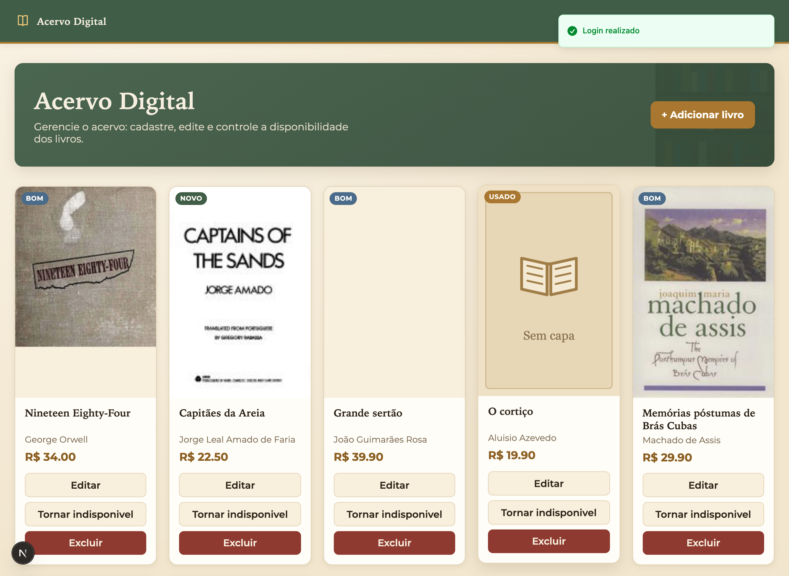
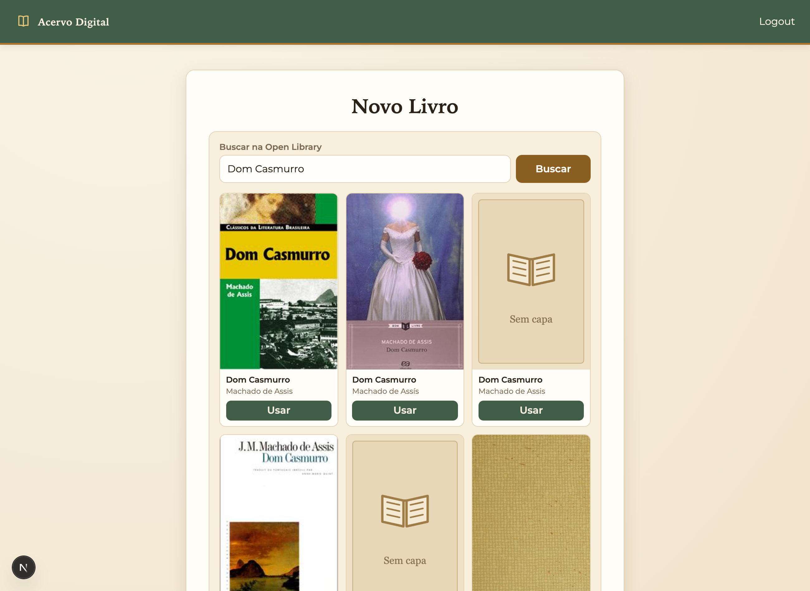
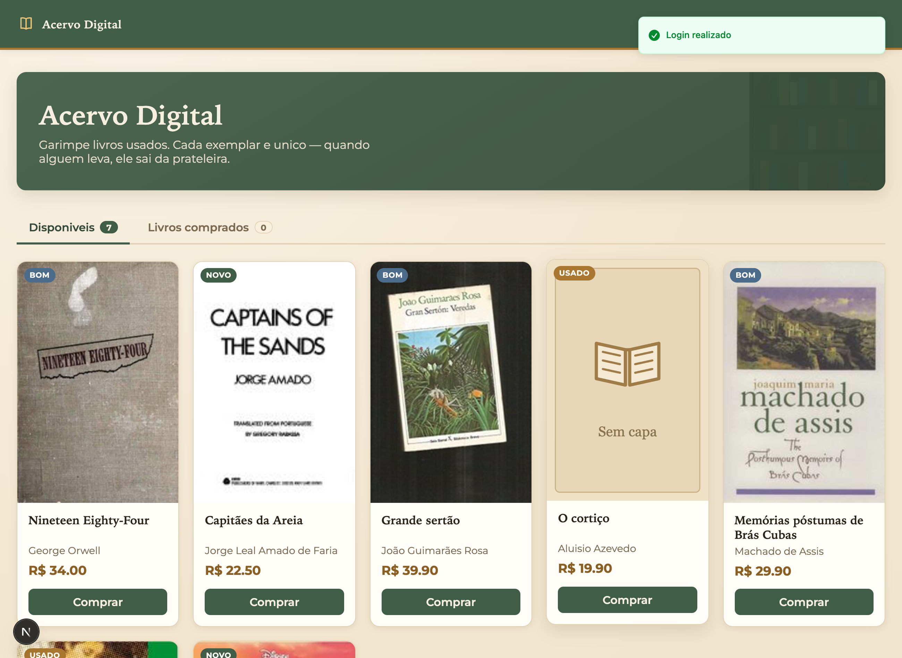
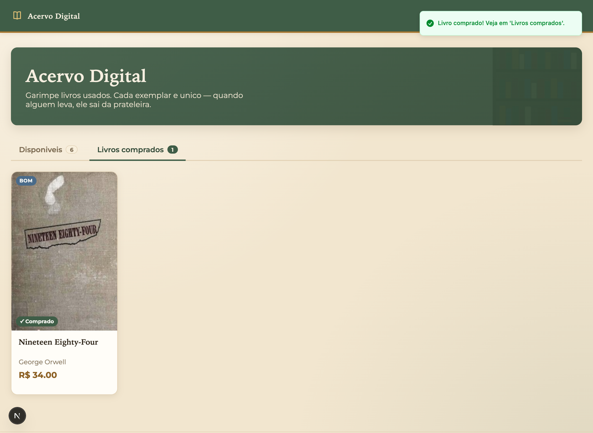

# Acervo Digital - Frontend

Frontend do projeto Acervo Digital, desenvolvido para a disciplina XDES03 - Programação Web.

A aplicação permite login, cadastro de usuários, visualização do catálogo de livros e interação com as funcionalidades de ADMIN e USER.

## Tecnologias

- Next.js
- React
- TypeScript
- CSS puro
- Zod
- Sonner

## Funcionalidades

- Tela de login
- Tela de cadastro de usuário
- Validação de formulário com Zod
- Logout
- Proteção de rotas privadas
- Listagem de livros do catálogo
- Tela de cadastro de livro para ADMIN
- Tela de edição de livro para ADMIN
- Busca de informações de livros na Open Library
- Compra simbólica de livro para USER
- Indicação de livro indisponível no catálogo

## Screenshots

### Tela de login


### Catálogo (visão do administrador)


### Cadastro de livro com busca na Open Library


### Catálogo (visão do usuário)


### Livros comprados


## Regras principais

- Usuário sem login é redirecionado para `/login`.
- Cadastro público cria usuário USER.
- ADMIN pode cadastrar, editar, excluir e alterar status de livros.
- USER pode visualizar livros e comprar livros disponíveis.
- Livro indisponível continua aparecendo no catálogo, mas não mostra botão de compra.

## Como executar

Instale as dependências:

```bash
npm install
```

Crie o arquivo `.env.local` com base no `.env.example`:

```env
NEXT_PUBLIC_API_URL=http://localhost:3001
```

Execute o projeto:

```bash
npm run dev
```

O frontend ficará disponível em:

```txt
http://localhost:3000
```

## Backend

Para utilizar o frontend, o backend precisa estar rodando em:

```txt
http://localhost:3001
```

## Usuário administrador

```txt
email: admin@acervodigital.com
senha: admin123
```

## Rotas principais

- `/login`
- `/create`
- `/`
- `/livros/criar`
- `/livros/[id]/editar`

## Observação

Este projeto foi desenvolvido seguindo a estrutura simples das aulas de frontend com Next.js, services com `fetch`, formulários com `useState`, validação com Zod e mensagens com Sonner.

## Integrantes

- **Thaís de Souza** — [github.com/thais-souza311](https://github.com/thais-souza311)
- **Gustavo Raponi** — [github.com/rapon1kt](https://github.com/rapon1kt)
